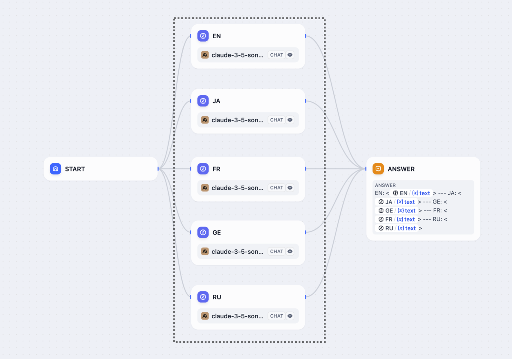

# Orchestrate Node

Both Chatflow and Workflow applications support node orchestration through visual drag-and-drop, with two orchestration design patterns: serial and parallel.

## Serial Node Design Pattern

In this pattern, nodes execute sequentially in a predefined order. Each node initiates its operation only after the preceding node has completed its task and generated output. This helps ensure tasks are executed in a logical sequence.

Consider a "Novel Generation" Workflow App implementing serial pattern: after the user inputs the novel style, rhythm, and characters, the LLM completes the novel outline, plot, and ending in sequence. Each node works based on the output of the previous node, ensuring consistency in the novel's style.

### Designing Serial Structure

1. Click the `+` icon between two nodes to insert a new serial node.
2. Sequentially link the nodes.
3. Converge all paths to the "End" node to finalize the workflow.

### Viewing Serial Structure Application Logs

In a serial structure application, logs display node operations sequentially. Click "View Logs - Tracing" in the upper right corner of the dialog box to see the complete workflow process, including input/output, token consumption, and runtime for each node.

## Designing Parallel Structure

This architectural pattern enables concurrent execution of multiple nodes. The preceding node can simultaneously trigger multiple nodes within the parallel structure. These parallel nodes operate independently, executing tasks concurrently and significantly enhancing overall workflow efficiency.

Consider a translation workflow application implementing parallel architecture: Once the user inputs the source text, triggering the workflow, all nodes within the parallel structure simultaneously receive instructions from the preceding node. This allows for concurrent translation into multiple languages, significantly reducing overall processing time.

### Parallel Structure Design Pattern

The following four methods demonstrate how to create a parallel structure through node addition or visual manipulation:

**Method 1** Hover over a node to reveal the `+` button. Click it to add multiple nodes, automatically forming a parallel structure.

**Method 2** Extend a connection from a node by dragging its `+` button, creating a parallel structure.

**Method 3** With multiple nodes on the canvas, visually drag and link them to form a parallel structure.

**Method 4** In addition to canvas-based methods, you can generate parallel structures by adding nodes through the "Next Step" section in a node's right-side panel. This approach automatically creates the parallel configuration.

**Notes:**

* Any node can serve as the downstream node of a parallel structure;
* Workflow applications require a single, unique "end" node;
* Chatflow applications support multiple "answer" nodes. Each parallel structure in these applications must terminate with an "answer" node to ensure proper output of content;
* All parallel structures will run simultaneously; nodes within the parallel structure output results after completing their tasks, with no order relationship in output. The simpler the parallel structure, the faster the output of results.

### Designing Parallel Structure Patterns

The following four patterns demonstrate common parallel structure designs:

#### 1. Normal Parallel

Normal parallel refers to the `Start | Parallel Nodes | End three-layer` relationship, which is also the smallest unit of parallel structure. This structure is intuitive, allowing the workflow to execute multiple tasks simultaneously after user input.

The upper limit for parallel branches is 10.

#### 2. Nested Parallel

Nested parallel refers to the Start | Multiple Parallel Structures | End multi-layer relationship. It is suitable for more complex workflows, such as needing to request an external API within a certain node and simultaneously passing the returned results to downstream nodes for processing.

A workflow supports up to 3 layers of nesting relationships.

#### 3. Conditional Branch + Parallel

Parallel structures can also be used in conjunction with conditional branches.

#### 4. Iteration Branch + Parallel

This pattern integrates parallel structures within iteration branches, optimizing the execution efficiency of repetitive tasks.

### Viewing Parallel Structure Application Logs

Applications with parallel structures generate logs in a tree-like format. Collapsible parallel node groups facilitate easier viewing of individual node logs.

